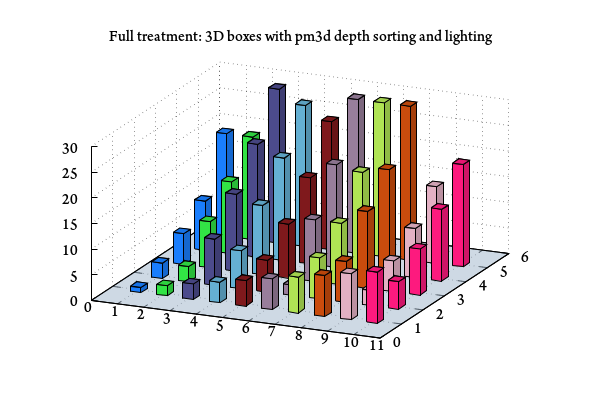
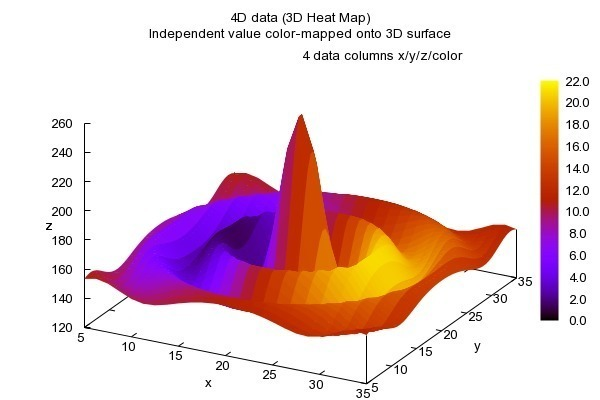
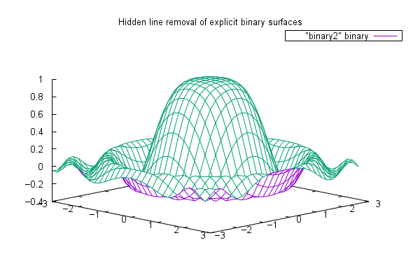

## 交叉引用 {#sec:crossref}

PanBook 使用 [pandoc-crossref](http://lierdakil.github.io/pandoc-crossref/) 处理交叉引用。

### 图片

```
{#fig:label}
```

要标记（隐式）图形，请在图像定义之后立即附加 `{#fig:label}`（其中 `label` 需要是一个独一无二的插图标签）。

这只适用于隐式图形，即在段落中单独出现的图像（将由 pandoc 呈现为带有标题的图形）

图像块和标签不能用空格分开。

#### 子图
结合`fenced_divs`语法，可以将图片分组为子图片。基本语法如下（效果见 [@fig:figureRef]）：

```markdown
::: {#fig:figureRef}
{#fig:figureRefA}

{#fig:figureRefB}

Caption of figure
:::
```

::: {#fig:figureRef}
{#fig:figureRefA width=40%}

{#fig:figureRefB width=40%}

Caption of figure
:::

综上所述，子图由一个具有图片 id 的 div 构成。该 div 的内容由几个段落组成。除最后一段外，所有段落都包含一个子图，并带有标题、图像和（可选的）引用属性。最后一段包含图片标题。

如果在段落中放置多个图片，那么仍然会呈现这些图形，但是 Pandoc 会在大多数输出中省略子图形标题（但是在 \LaTeX 中它会像预期的那样工作）。您可以使用特定于输出的技巧来解决这个问题，或者使用 `subfigGrid`（见下文）。

输出是可定制的，使用元数据字段。有关更多信息，请参见 [Customization](http://lierdakil.github.io/pandoc-crossref/#customization)。

默认设置将从上面的例子中产生以下等价的标记：

```markdown
<div id="fig:figureRef" class="subfigures">

{#fig:figureRefA}

{#fig:figureRefB}

Figure 1: Caption of figure. a — subfigure 1 caption, b — subfigure 2
caption

</div>
```

对子图的引用将呈现为 figureNumber (subfigureNumber)，例如，在这个特定的例子中，`[@fig:figureRefA]` 将生成 [@fig:figureRefA]。

可以将 `notitle` 样式添加到图片中，以完全抑制子图标题。注意，抑制的子图仍然会被计数。

#### 子图网格

如果需要对网格中的子图进行对齐，并且不能使用输出格式样式，则可以使用 subfigGrid 选项。此选项将用表格中组织子图。

不同的段落作为表格的行，段落内的子图作为表格的列。

列宽度将从相应图像的宽度属性中提取，例如（效果见 [@fig:coolFig]）：

```markdown
::: {#fig:coolFig}
{#fig:cfa width=40%}
{#fig:cfb width=40%}

{#fig:cfc width=40%}
{#fig:cfd width=40%}

Cool figure!
:::
```

::: {#fig:coolFig}
{#fig:cfa width=40%}
{#fig:cfb width=40%}

{#fig:cfc width=40%}
{#fig:cfd width=40%}

Cool figure!
:::

将产生列宽度为 `40%` 和 `40%` 的子图网格。

表格宽度计算只考虑图像的第一行，其他行完全忽略。

除了图像之外的任何元素都会被静默地忽略。因此，任何文本、空格、软换行符等都将静默地从输出中消失。当然，这不适用于图片标题段落。

所有图像将自动设置宽度属性为 `100%`，以便填充整个列。

在除 `%` 之外的任何地方指定宽度都会引发错误。

如果未指定第一行中某些图像的宽度，则这些图像将在剩余空间中均匀地展开。

如果没有为第一行中的任何图像指定宽度，那么这些图像将平均占用页面宽度的 99%（因为 Pandoc 忽略了表的宽度属性）。

在 LaTeX 输出中忽略这个选项，但是段落断行应该产生类似的效果，所以图像应该正确地排版。您不需要启用 subfigGrid 就可以使用 LaTeX，但是您仍然可以启用它。

### 公式

要标记一个跨行公式，请在 math 区块之后立即添加 `{#eq:label}`（其中 label 需要是一个独一无二的公式标签），源码如下（效果见 [@eq:label]）：
```latex
$$ x=\frac{-b\pm\sqrt{b^2-4ac}}{2a} $$ {#eq:label}
```

$$ x=\frac{-b\pm\sqrt{b^2-4ac}}{2a} $$ {#eq:label}

数学块和标签可以用一个或多个空格分隔。

还可以在元数据中设置 `autoEqnLabels: true` 来实现为所有跨行公式编号。但是，请注意，如果没有显式的标签，就无法引用公式。

公式编号将在数学内部排版，前面有 `\qquad`。如果您想使用表格，请在元数据中设置 `tableEqns: true` 选项。根据输出格式的不同，表可能比 `\qquad` 工作得更好，也可能更差。

### 表格

标记表格请在表格标题的末尾附加 `{#tbl:label}`（label 是引用这个表格的惟一标签）。标题和标签必须至少用一个空格隔开。

```markdown
a   b   c
--- --- ---
1   2   3
4   5   6

: Caption {#tbl:label}
```

### 标题

您还可以标记任何级别的章节。章节标签使用原生 Pandoc 语法，但必须以 `sec:` 开头，例如。

``` markdown
## Section {#sec:section}
```

### 代码块

代码块 ID 应以 `lst:` 开头，例如 `{#lst:label}`

`caption` 属性将转换为代码块标题。如果代码块同时有 ID 和 `caption`，将会被编号。

~~~markdown
```{#lst:code .haskell caption="Listing caption"}
main :: IO ()
main = putStrLn "Hello World!"
```
~~~

### 引用

以下都是合法的引用方式：

```markdown
[@fig:label1;@fig:label2;...]
[@eq:label1;@eq:label2;...]
[@tbl:label1;@tbl:label2;...]
@fig:label
@eq:label
@tbl:label
```
引用语法重度参考了参考文献引用（citation）语法。基本的引用是通过 `@` 创建的，然后是带有前缀的标签。也可以引用一组对象，方法是将它们放在括号中并且用 `;` 作为分隔符。相似的对象将按照它们出现在引文括号中的顺序进行分组，并将序号缩短，如 `1,2,3` 将缩短为  `1-3`。

您可以将第一个引用字符大写以获得大写前缀，例如 `[@Fig:label1]` 默认将生成 `Fig. ...` 。除非使用元数据设置覆盖，否则将每个单词的首字母大写的非大写前缀自动派生出大写前缀。有关更多信息参见 [Customization](https://lierdakil.github.io/pandoc-crossref/#customization)。

#### 链接到引用元素

若要使引用带有指向引用元素的超链接，请在元数据中设置 `linkReferences: true`。这对 \LaTeX 输出没有影响，因为在 \LaTeX 中，这种引用是 `hyperref` 包处理的。

#### 单个引用自定义前缀
可以为每个引用提供自己的前缀。`[Prefix @reference]` 将以前缀逐字替换默认前缀（`fig./sec./` 等），例如 `[Prefix @fig:1]` 将被渲染为 `Prefix 1` 而不是默认的 `fig .1`。

#### 不生成前缀

在 `@` 前添加 `-`，就像这样 `[-@citation]`，将禁用默认前缀，例如 `[-@fig:1]` 将只生成 `1`，而没有 `fig.` 前缀。

在分组的引用中，有或没有前缀的引文将在不同的组中。所以 `[-@fig: 1;@fig: 2;-@fig:3]` 将被渲染为 `1，fig. 2, 3`，所以要注意这个特性。同样，非连续序列不会分组在一起。

### 自定义交叉引用配置

使用选项 `--crs`指定自定义的交叉引用配置，默认为`crs/zh-CN.yaml`。配置方法请参考`pandoc-crossref`文档：https://lierdakil.github.io/pandoc-crossref