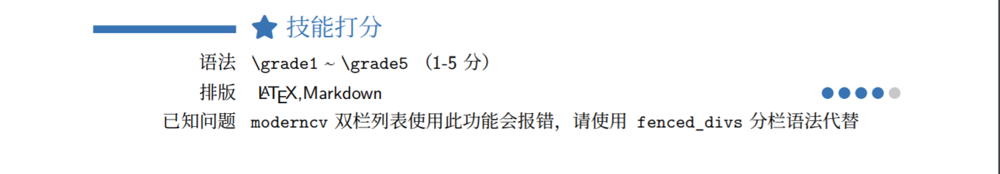

## grade

::: {.info caption="扩展信息"}
使用场景
  ~ 打分命令，适用于简历

启用状态
  ~ 默认在 cv 中启用

格式支持  
  ~ \LaTeX 

语法系列
  ~ raw latex
:::

#### 示例

```markdown
# \faStar~技能打分

- [语法]{.cat} `\grade1` ~ `\grade5` （1-5 分）
- [排版]{.cat} \LaTeX,Markdown         [\grade4]{.comment}
- [已知问题]{.cat}`moderncv`双栏列表使用此功能会报错，请使用`fenced_divs`分栏语法代替
```

效果

